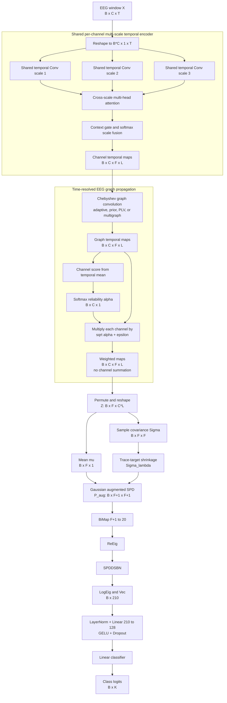
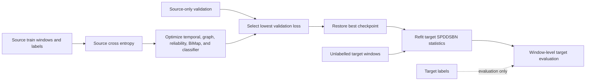

# MS_TGC_SPDDSBN Model Flowchart

## Full Forward Path



For the default `F=64`, the augmented input to BiMap is `65 x 65`. BiMap
reduces it to `20 x 20`, so tangent vectorization remains
`20 * 21 / 2 = 210`.

## Mathematical Readout

For reliability-weighted graph maps `H`:

```text
alpha_c = softmax(q(mean_L(H_c)))
H_c     = sqrt(alpha_c + epsilon) * H_c
Z       = reshape(H) in R^(B x F x (C*L))
mu      = mean_observation(Z)
Sigma   = centered(Z) centered(Z)^T / (C*L - 1)
Sigma_l = (1-lambda) Sigma + lambda tr(Sigma)/F I + epsilon I
P_aug   = [[Sigma_l + mu mu^T, mu], [mu^T, 1]]
```

The square-root reliability factor makes a channel's second-order contribution
approximately proportional to `alpha_c`, instead of `alpha_c^2`. The shrinkage
term and diagonal epsilon keep the covariance positive definite before the
Gaussian augmentation.

## Training And Target Adaptation



No target labels, pseudo-label loss, domain-adversarial loss, MMD, or graph
matching loss is used by the full model. Same-domain single-session refitting
is disabled; `--no-target-adapt` disables target SPDDSBN refitting entirely.

## Consistent Ablations

| Model | Shared temporal | Cheb | Statistical readout | Normalization |
|---|---|---|---|---|
| `mstgc_dta_ce` | Multi-scale | No | First-order mean | None |
| `mstgc_dta_cheb_ce` | Multi-scale | Yes | First-order mean | None |
| `mstgc_dta_cheb_eudsbn` | Multi-scale | Yes | First-order mean | Euclidean DSBN |
| `mstgc_mean_ce` | Multi-scale | Yes | First-order mean | None; alias of `mstgc_dta_cheb_ce` |
| `mstgc_cov_spddsbn` | Multi-scale | Yes | Covariance SPD | SPDDSBN |
| `mstgc_augspd_spddsbn` | Multi-scale | Yes | Augmented SPD | SPDDSBN; full-model alias |
| `mstgc_dta_cheb_spdmbn` | Multi-scale | Yes | Augmented SPD | Shared SPD BN |
| `mstgc_dta_cheb_spdbn` | Multi-scale | Yes | Augmented SPD | Shared SPD BN alias |
| `ms_tgc_spddsbn` | Multi-scale | Yes | Augmented SPD | SPDDSBN |
| `mstgc_wo_dta` | Single-scale | Yes | Augmented SPD | SPDDSBN |
| `mstgc_wo_cheb` | Multi-scale | No | Augmented SPD | SPDDSBN |
| `mstgc_wo_channel_attention` | Multi-scale | Yes | Augmented SPD | SPDDSBN; uniform channel weights |
| `mstgc_wo_spddsbn` | Multi-scale | Yes | Augmented SPD | None |

The graph-source variants `mstgc_graph_prior`, `mstgc_graph_plv`, and
`mstgc_graph_multigraph` retain the complete augmented-SPD model and change
only the adjacency source.
